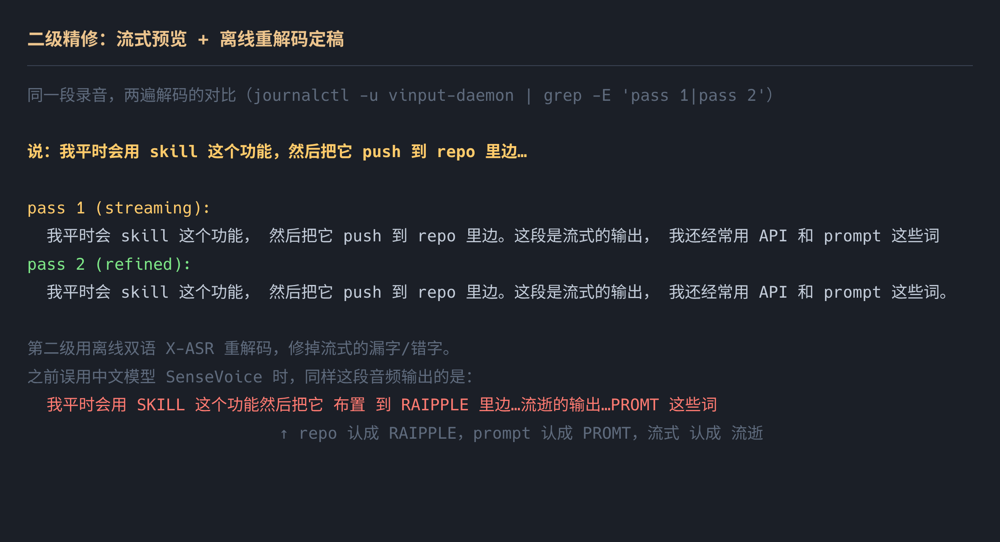
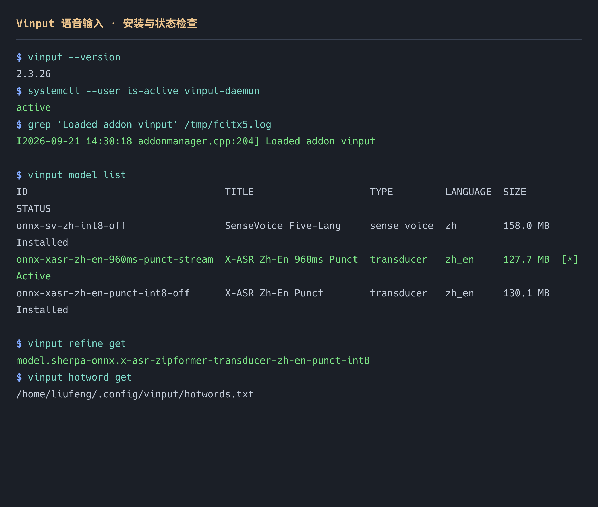
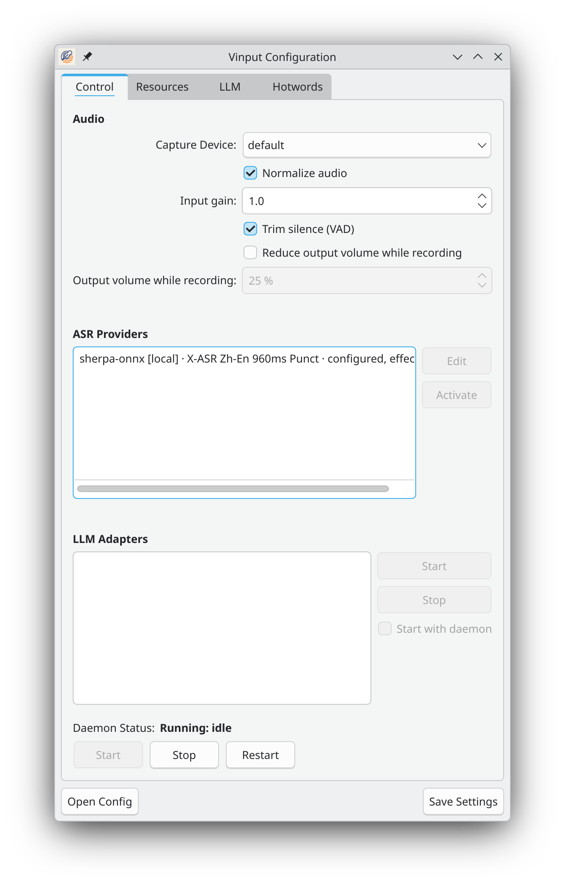

# 安装与配置：二级精修版（流式预览 + 离线重解码）

本文档对应 `feat/issue-1-two-pass-refinement` 分支新增的**二级精修**能力。
面向 Arch Linux + KDE Wayland + fcitx5，无独显（纯 CPU）环境实测通过。

> **一句话说明它多做了什么**：上游本地 ASR 只能二选一——流式（响应快、准确率一般）
> 或离线（准确率高、松手才出字）。本分支把它变成**接力**：说话时用流式模型边说边出，
> 松手后用另一个更准的离线模型对**同一段音频**重解码一遍，用它的结果定稿。

---

## 0. 效果示意

同一段录音，两遍解码的对比：



第二级只多花 **150–250 ms**（SenseVoice int8 解 5 秒音频约 147 ms；本机实测的
X-ASR 离线模型同量级），用户基本无感。

---

## 1. 架构

```
        ┌─────────────────────────── fcitx5 ───────────────────────────┐
        │  addon: fcitx5-vinput.so（上游，未改动）                      │
        │  热键 Alt_R → 开始/停止录音 → 通过 D-Bus 调 daemon            │
        │  收到 partial → 渲染成 preedit；收到 final → commitString 上屏 │
        └───────────────────────────────┬──────────────────────────────┘
                                        │ D-Bus  org.fcitx.Vinput
        ┌───────────────────────────────▼──────────────────────────────┐
        │  vinput-daemon                                                │
        │   PipeWire 采集 → VAD 静音裁剪 →                              │
        │                                                               │
        │   ┌── 本分支新增：refining_backend ──────────────────────┐    │
        │   │  pass 1  流式模型（X-ASR 960ms）→ 边说边出            │    │
        │   │  pass 2  离线模型（X-ASR 离线）→ 整段重解码 → 定稿    │    │
        │   └──────────────────────────────────────────────────────┘    │
        │   → 可选 LLM 场景后处理 → 回传 addon                          │
        └───────────────────────────────────────────────────────────────┘
```

二级精修**完全实现在 daemon 的 ASR 层**，不改 addon、不改 D-Bus 接口、不改提交语义。
不配置 `refine_model` 时行为与上游完全一致。

---

## 2. 安装

有三种方式，按你的偏好选一个：

| 方式 | 适用 | 有二级精修 | 需要 sudo |
|---|---|---|---|
| **A** 装上发行版包 | 只想先试试语音输入 | ❌ | ✅ 一次 |
| **B** 手动编译本分支 | 想自己控制每一步 | ✅ | ✅ 一次 |
| **C** 交给 Agent | 不想看过程，要结果 | ✅ | ✅ 一次 |

### 方式 C：交给 Agent（推荐）

把下面整段发给任意能执行终端命令的 agent（Codex / Claude Code / Pi / Cursor 等）。
它自带验收标准，能自己判断成败：

```text
请在这台 Linux 机器上安装并配置 vinput 语音输入（fcitx5 插件，含「二级精修」）。

## 环境前提
- 目标机：Arch Linux + KDE Wayland，fcitx5 已在运行
- 代码仓库：https://github.com/mainliufeng/fcitx5-vinput  （fork，main 分支已含二级精修）
- 安装脚本（可选，参考它做了哪些事）：
  https://github.com/mainliufeng/dotfiles 里的 linux/desktop/input-method/setup-vinput.sh
- 参考文档：仓库内 docs/install-and-config-zh.md

## 要做什么
1. 检查依赖，缺的用 pacman 装：
   base-devel cmake ninja clang gettext fcitx5 pipewire qt6-base nlohmann-json libarchive openssl curl
   并确认 archlinuxcn 仓库里的 sherpa-onnx 已安装
2. 克隆 fork 并编译安装：
   git clone https://github.com/mainliufeng/fcitx5-vinput.git ~/.cache/fcitx5-vinput
   cmake --preset release-clang-mold \
     -DCMAKE_EXE_LINKER_FLAGS=-fuse-ld=gold \
     -DCMAKE_SHARED_LINKER_FLAGS=-fuse-ld=gold \
     -DCMAKE_MODULE_LINKER_FLAGS=-fuse-ld=gold
   cmake --build --preset release-clang-mold -j$(nproc)
   sudo cmake --install ~/.cache/fcitx5-vinput/build
   （若机器上有 mold 或 lld，可去掉上面三行 -fuse-ld 覆盖）
3. 下载并配置两个模型：
   vinput model add onnx-xasr-zh-en-960ms-punct-stream   # 第一遍：流式
   vinput model add onnx-xasr-zh-en-punct-int8-off       # 第二遍：离线精修
   vinput model use onnx-xasr-zh-en-960ms-punct-stream
   vinput refine set onnx-xasr-zh-en-punct-int8-off
   ⚠️ 第二遍必须是**双语离线**模型。不要用 SenseVoice（会把 repo 认成 RAIPPLE）。
4. 配置词典：
   生成一份「编程领域」热词表写到 ~/.config/vinput/hotwords.txt
   （格式要求见仓库文档 §3.4），然后
   vinput hotword set ~/.config/vinput/hotwords.txt
5. 启动服务并**彻底重启 fcitx5**：
   systemctl --user enable --now vinput-daemon.service
   pkill -x fcitx5; sleep 2; setsid fcitx5 -d --replace
   （这一步不能省，运行中的 fcitx5 不会加载新装的 addon）
6. 自己验收，以下是硬性通过条件：
   a) systemctl --user is-active vinput-daemon   → active
   b) fcitx5 日志里有 "Loaded addon vinput"
   c) 用 pw-record 录一段音频，调 `vinput recording start/stop` 或直接看 daemon 日志，
      确认日志里同时出现 pass 1 与 pass 2 两行
   d) 确认后端是 backend=sherpa-streaming+refine
   e) `vinput refine get` 返回完整模型 ID（以 model. 开头）

## 约束
- 不要修改 ~/.config/fcitx5/ 下已有的输入法配置（用户在用 fcitx5-rime）
- 不要卸载或替换系统的 fcitx5 包
- 每一步失败要报告**原始错误**，不要静默跳过、不要假装成功
- 需要 sudo 时明确告诉用户将弹授权框

## 完成后请报告
- 每个验收项的**实际命令输出**（不是“已完成”）
- 两遍解码的实测文本对比
- 遇到的坑与解决方式
```

需要手动跟着做时，用下面两种方式。

### 方式 A：只装上游版（简单，但没有二级精修）

```bash
# archlinuxcn 仓库
sudo pacman -S fcitx5-vinput

# 或 AUR
yay -S fcitx5-vinput-bin
```

装完直接跳到第 3 节配置中的「最小配置」。**这种方式没有 `vinput refine` 命令。**

### 方式 B：本分支（含二级精修）

#### 2.1 前置依赖

```bash
# 构建工具
sudo pacman -S --needed base-devel cmake ninja clang gettext

# 运行时依赖（sherpa-onnx 在 archlinuxcn）
sudo pacman -S --needed fcitx5 pipewire qt6-base nlohmann-json \
     libarchive openssl curl sherpa-onnx
```

> 本机实测：`nlohmann_json` 与 `CLI11` 即使不装也会由 CMake `FetchContent` 自动拉取，
> 但装了更快、更适合离线构建。

#### 2.2 取代码并构建

```bash
git clone https://github.com/mainliufeng/fcitx5-vinput.git
cd fcitx5-vinput
git checkout feat/issue-1-two-pass-refinement

cmake --preset release-clang-mold \
  -DCMAKE_EXE_LINKER_FLAGS=-fuse-ld=gold \
  -DCMAKE_SHARED_LINKER_FLAGS=-fuse-ld=gold \
  -DCMAKE_MODULE_LINKER_FLAGS=-fuse-ld=gold
cmake --build --preset release-clang-mold -j$(nproc)
sudo cmake --install build
```

> **关于链接器**：上游预设用 `mold`。若未安装 `mold` 也没有 `lld`，用上面的
> `-fuse-ld=gold` 覆盖即可（`ld.gold` 随 binutils 自带）。

安装产物：

| 路径 | 内容 |
|---|---|
| `/usr/lib/fcitx5/fcitx5-vinput.so` | fcitx5 addon |
| `/usr/bin/vinput-daemon`、`/usr/bin/vinput`、`/usr/bin/vinput-gui` | 守护进程 / CLI / 图形配置 |
| `/usr/share/systemd/user/vinput-daemon.service` | 用户级 systemd 服务 |
| `/usr/share/fcitx5/addon/vinput.conf` | addon 注册（`Category=Module`，**不是输入法**） |

#### 2.3 启动

```bash
systemctl --user enable --now vinput-daemon.service
```

**必须重启 fcitx5**，否则运行中的进程不会加载新 addon（这一步很容易漏，见第 6 节坑 1）：

```bash
fcitx5 -r -d
# 或
pkill -x fcitx5; sleep 2; fcitx5 -d --replace
```

#### 2.4 验证安装



---

## 3. 配置

### 3.1 下载模型

```bash
vinput model list --available      # 看可下载列表
vinput model add onnx-xasr-zh-en-960ms-punct-stream   # pass 1：流式（127.7 MB）
vinput model add onnx-xasr-zh-en-punct-int8-off       # pass 2：离线双语（130.1 MB）
```

### 3.2 设置两个模型

```bash
vinput model use onnx-xasr-zh-en-960ms-punct-stream   # 主模型 = 流式（first pass）
vinput refine set onnx-xasr-zh-en-punct-int8-off      # 精修模型 = 离线（second pass）
```

> `refine set` 接受 `model list` 显示的短 ID，内部会解析成完整的 `model.<源>.<名>`；
> 模型管理器只认完整 ID，所以不要把短 ID 直接写进 `config.json`。

配置写入 `~/.config/vinput/config.json`：

```json
{
  "asr": {
    "active_provider": "sherpa-onnx",
    "providers": [
      {
        "id": "sherpa-onnx",
        "type": "local",
        "model": "model.sherpa-onnx.x-asr-960ms-streaming-zipformer-transducer-zh-en-punct-int8",
        "refine_model": "model.sherpa-onnx.x-asr-zipformer-transducer-zh-en-punct-int8",
        "timeout_ms": 15000
      }
    ]
  }
}
```

**不想要二级精修**就清空：

```bash
vinput refine clear      # 退回纯流式（更快，但松手后不再重解码）
```

### 3.3 选精修模型的硬性要求：**必须是双语离线模型**

这一条是踩过坑才明白的，请务必注意：

| 精修模型 | 结果 |
|---|---|
| **X-ASR 离线（zh-en，双语 BPE）** | ✅ 中文、英文、中英混说、标点、大小写全对 |
| ❌ SenseVoice（中文倾向） | ❌ **会破坏英文词**：`repo`→`RAIPPLE`、`prompt`→`PROMT`、`push`→`布置`、`流式`→`流逝`，且英文全变大写 |
| ❌ 另一个流式模型 | 代码会拒绝（`refine_model` 只接受 `sherpa-offline` 后端），并降级为纯流式 |

原因：SenseVoice 是中文/多语训练但**英文词汇量弱**，它会把流式已经认对的英文词"纠正"成
形状相似的其他 token。**二级精修的前提是第二级至少不能比第一级差。**

### 3.4 词典（热词）：提升术语与专有名词

热词是一个纯文本文件，一行一个词条，**两遍解码都吃这张表**（流式与离线精修都会读它，并自动切到 `modified_beam_search` 解码）。

```bash
# 词典文件在用户配置里，不进任何代码仓库
cat > ~/.config/vinput/hotwords.txt <<'EOF'
repo:5.0
commit:5.0
API:5.0
prompt:4.5
MCP:5.0
流式:4.5
EOF

vinput hotword set ~/.config/vinput/hotwords.txt
systemctl --user restart vinput-daemon
```

#### 格式规则

| 规则 | 说明 |
|---|---|
| 一行一个词条 | 空行会被忽略 |
| **不支持注释** | `#` 开头会被当成词条，不要写注释 |
| 可选权重 | 写成 `词条:5.0`，**冒号两侧不能有空格** |
| 权重范围 | 1–10，不写则用模型元数据里的 `hotwords_score`（多数模型是 1.5） |

#### 权重怎么调

- 从 **3.0–4.0** 起步；绝大多数技术词 4.0 够用
- 经常被听错、且形近词多的（`MCP`、`submodule`、`fcitx5`）可以给 **5.0**
- 过于通用的词（`tool`、`build`、`release`）给 3.0 或干脆不收——**权重过高会凭空插入不存在的词**
- 数量控制在 **60–120 条**；表越长解码开销越大，收益递减

#### 预置的编程领域词典

dotfiles 里带了一份可直接用的编程词表（113 条，覆盖 agent/LLM、git 工作流、语言与工具、Web/API、Linux 桌面栈、易听错的中文技术词）：

```
~/dotfiles/linux/desktop/input-method/hotwords.txt
```

由 `setup-vinput.sh` 自动安装到 `~/.config/vinput/hotwords.txt`。改完重新 `vinput hotword set` + 重启 daemon 即可。

#### 让 Agent 按领域生成词典

把下面这段发给 agent，换成你自己的领域：

```text
请为 vinput 语音输入生成一份「<你的领域>」热词表，保存到 ~/.config/vinput/hotwords.txt。

格式要求：
- 纯文本，一行一个词条；不要注释、不要空行、不要多余说明
- 需要逐词权重时写成 `词条:权重`（冒号两侧不能有空格），范围 1–10
- 不需要权重就不要写冒号

内容要求：
- 收录该领域的高频专有名词、缩写、产品名、框架名
- 特别收录「中文语音模型容易听错的英文技术词」（它们在中文语境里最容易被谐音带跑）
- 同时收录该领域容易被听错的**中文**术语
- 权重建议：常错且形近词多的给 5.0，普通术语 4.0，通用词 3.0 或直接不收
- 总数控制在 60–120 条

做完后执行：
  vinput hotword set ~/.config/vinput/hotwords.txt
  systemctl --user restart vinput-daemon

最后用下面这条确认没有解析错误（应无输出）：
  journalctl --user -u vinput-daemon --since '1 minute ago' | grep -iE 'hotword|invalid' 
```

#### 验证有没有生效

```bash
# 1. 确认文件被接受、daemon 重启后无解析错误
journalctl --user -u vinput-daemon --since '1 minute ago' | grep -iE 'hotword|invalid'

# 2. 看识别结果（热词表命中的专有名词会更容易被认对）
journalctl --user -u vinput-daemon | grep -E 'pass 1|pass 2' | tail -4
```

> ⚠️ 热词是**解码期偏置**，不是替换：声学证据很强时压不过去（实测四川话里「子鸡→自己」加词也纠不回来）。
> 它擅长补**术语召回**，不擅长纠正**同音错字**——后者需要另一套机制（拼音同音替换，尚未实现）。

### 3.5 音频与 VAD

```bash
vinput device list                 # 列可用输入设备
vinput device use default          # 或指定设备名
```

`config.json` 中相关项：

```json
"global": { "capture_device": "default", "duck_output_while_recording": false },
"asr": {
  "normalize_audio": true,     // 峰值归一化，麦克风音量低时很有用
  "input_gain": 1.0,           // 持续增益；实测录音峰值仅 0.06 时仍能识别
  "vad": {
    "enabled": true,           // 强烈建议开启：去首尾静音，也避免静音幻觉
    "threshold": 0.45,
    "min_speech_duration": 0.15,
    "min_silence_duration": 0.5,
    "speech_pad_ms": 300
  }
}
```

### 3.6 图形界面



```bash
vinput-gui
```

> ⚠️ **当前 GUI 还没有"二级精修"这一项**——`refine_model` 只能用 CLI 配
> （`vinput refine set/get/clear`）。GUI 保存配置时不会覆盖它，但界面上看不到。
> 补 GUI 界面是后续工作。

---

### 3.7 LLM 后处理（纠错与术语还原）

热词只能做**解码期偏置**，纠不回同音字和它没见过的术语。这类错误交给 LLM 后处理——
这也是豆包、微信输入法在云端做的第三步（大模型 ASR → 上下文注入 → **LLM 改写**）。

#### 概念

```
ASR 原始文本 → [场景 prompt + LLM] → 改写后的文本
```

- **场景（scene）** = prompt + 绑定的 provider + model
- **LLM provider** = 一个 OpenAI 兼容端点（**地址可配**，不限于官方 API）
- 去重后若 LLM 结果与原文完全相同 → **直接上屏，不弹菜单**
- 若不同 → 弹候选菜单，**默认高亮 LLM 版**，按 `1` 可随时选回 ASR 原文

#### 配置一个 provider（任意 OpenAI 兼容地址）

`api_key` 可以写**明文**，也可以写**环境变量引用** `$NAME` / `${NAME}`。推荐后者：密钥不进配置文件，
也就不会被备份、同步或截图带出去。

```bash
# 推荐：配置文件里只存引用，密钥由 daemon 的环境提供
vinput llm add deepseek \
  -u "https://api.deepseek.com/v1" \
  -k '$DEEPSEEK_API_KEY' \
  -e '{"thinking":{"type":"disabled"}}'

vinput llm test deepseek     # 验证连通性，会列出可用模型
```

环境引用在**调用时**解析，所以变量未设置时会直接报错（而不是发一个必定 401 的请求）：

```
Provider 'deepseek' 引用的环境变量未设置：$DEEPSEEK_API_KEY
```

**daemon 是 systemd 用户服务，不继承你 shell 里的 export。** 要让它拿到密钥，用
`EnvironmentFile` 挂一个只放凭据的文件（比如存在 dotfiles-private 里，不入仓）：

```bash
mkdir -p ~/.config/systemd/user/vinput-daemon.service.d
cat > ~/.config/systemd/user/vinput-daemon.service.d/llm-env.conf <<'EOF'
[Service]
EnvironmentFile=-%h/dotfiles-private/deepseek/env.sh
EOF
systemctl --user daemon-reload && systemctl --user restart vinput-daemon
```

（开头的 `-` 表示文件不存在时不报错。）

`-e/--extra-body` 可以合并任意字段进请求体，用来适配不同后端的参数习惯。

> ⚠️ **实测：关掉推理链是必须的。** DeepSeek Flash 默认会输出 `reasoning_content`，
> 同一句纠错实测：**开推理 ≈ 2.6–51 s，关推理 ≈ 0.6–0.9 s**。推理链对这类
> "改错字"任务没有任何帮助，只是白白增加延迟和 token。

#### 配置"纠错"场景

```bash
vinput scene add --id tech-polish \
  --label "技术纠错" \
  --prompt "$(cat polish-prompt.md)" \
  --provider deepseek --model deepseek-flash \
  --count 1 --timeout 15000 --context-lines 0 \
  --raw-cand false

vinput scene use tech-polish    # 激活；用 __raw__ 可随时关掉
```

> **`--raw-cand false` 很重要，否则每句都会让你选一次。**
> 默认 `raw_cand=true` 会把**原始 ASR 文本也作为一个候选**，于是“原始 + LLM 改写”两个候选
> 触发候选菜单（addon 的条件是 `payload.candidates.size() > 1`）。
> 关掉之后候选只剩 LLM 结果一个 → **直接上屏，不弹菜单**。
>
> 代价：如果 LLM 改错了，你没有“选回原文”的入口（只能撤销或重说）。想要那个兜底就把它设回 `true`。
>
> 不确认到底弹不弹？开 `VINPUT_DEBUG=1` 看这一行：
> ```
> postprocess scene=tech-polish candidates=1 committed_from=llm menu=no
> ```

dotfiles 里带一份现成的 `polish-prompt.md`，它的约束是关键：

| 约束 | 为什么 |
|---|---|
| 只改识别错误（同音字 / 英文术语 / 大小写 / 标点） | 避免把输入法变成"改写器" |
| **保持输入的标点与空格完全不变** | ⚠️ 关键：去重是**精确字符串比较**。不加这条，LLM 会把 ASR 在中文逗号后插的空格去掉，导致几乎每句都判定为"有改动"而弹菜单 |
| 不确定就保留原文 | 避免编造；模棱两可的同音字宁可不动 |
| 只输出结果，不要解释 | prompt 会被框架再包一层要求 JSON `{"candidates":[...]}` |

#### 实测效果

| 输入（ASR 原文） | LLM 输出 |
|---|---|
| `我平时会用 SKILL 这个功能然后把它 布置 到 RAIPPLE 里边这段是流逝的输出去` | `…skill 这个功能然后把它 push 到 repo 里边这段是流式的输出去` |
| `子鸡就是在那个…就是感觉是演得特别好` | `自己就是在那个…就是感觉是演得特别好` |
| `就是平凡的啊， 不认识记下来， frequently 平凡的` | `就是频繁的啊， 不认识记下来， frequently 频繁的` |
| `我平时会用 skill 这个功能， 然后把它 push 到 repo 里面。`（本来就对） | **逐字不变**（不弹菜单） |

延迟：约 **0.6–0.9 s/句**（推理链关闭、DeepSeek Flash）。

#### 失败时的行为

LLM 请求失败/超时 → **保留 ASR 原文**，不会丢句子。

> ⚠️ 已知限制：**连接超时硬编码为 5 s**（`kDefaultConnectTimeoutMs`，
> 实际取 `min(场景 timeout, 5000)`），无法从配置调大。API 网络拥塞时会看到
> `failed after 5001ms: Timeout was reached`，此时回退到未经纠错的原文。
>
> ✅ 本分支修掉了一个安全问题：上游在 `VINPUT_DEBUG=1` 时会**明文打印
> `Authorization: Bearer <key>`**（原代码注释还写着 "users who share logs are
> responsible for redacting first"）。现在 `Authorization` / `Proxy-Authorization` /
> `api-key` / `x-api-key` / `Cookie` 这些头的值会输出为 `<redacted>`，日志可以安全粘贴。

#### 关闭

```bash
vinput scene use __raw__     # 回到纯 ASR，零额外延迟
```

---

## 4. 使用

vinput 是 fcitx5 的 **Module**，不是可选输入法——**不需要切换到它**。

| 按键 | 行为 |
|---|---|
| **右 Alt 短按** | 开始录音；再短按一次停止 |
| **右 Alt 长按** | 按住说话，松开即停（push-to-talk） |
| **右 Control** | 选中文本后按住，用语音指令改写选中内容 |
| **右 Shift** | 打开命令面板（`/model`、`/asr`、`/scene`） |

按键可在 fcitx5 配置界面中自定义。

**使用时必须有一个聚焦的文本输入框**（addon 是通过当前输入上下文上屏的）。

---

## 5. 性能与资源

本机实测（Intel i9-12900H，14 核 20 线程，**无独显**，Arch + KDE Wayland）：

| 配置 | 常驻内存 | 空闲 CPU | 松手到定稿 |
|---|---|---|---|
| 纯流式（`refine clear`） | ~300 MB | ≈0 | 无二次解码 |
| **流式 + X-ASR 离线精修（推荐）** | ~590 MB | ≈0 | +150–250 ms |
| 流式 + SenseVoice 精修（不推荐，伤英文） | ~640 MB | ≈0 | +150–250 ms |

流式首字延迟约 1.0–1.6 s（由模型前瞻决定，非算力限制）。

---

## 6. 故障排查（都是实际踩过的坑）

### 坑 1：按热键完全没反应

**最常见原因：装完 addon 后没有重启 fcitx5。**

`fcitx5 -r -d` 有时不会真正替换旧进程。先确认运行中的进程启动时间**晚于** addon 安装时间：

```bash
ps -o pid,lstart -p $(pgrep -x fcitx5)     # 启动时间必须晚于 addon 安装时间
grep 'Loaded addon vinput' <(journalctl --user -b 2>/dev/null)   # 或看 fcitx5 日志
```

注意 `fcitx5-diagnose` 显示的 "Vinput" 是**读磁盘上的 conf 文件**，不代表运行中的进程加载了它。

彻底重启：

```bash
pkill -x fcitx5; sleep 2; fcitx5 -d --replace
```

### 坑 2：英文技术词识别成乱码 / 被"改坏"

精修模型选错了。见 §3.3——**不要用 SenseVoice 做精修**，换成双语的离线 X-ASR。

### 坑 3：模型设置后没生效

```bash
vinput refine get        # 确认存的是完整 ID
journalctl --user -u vinput-daemon | grep 'second pass' | tail -3
```

若看到 `second pass disabled ...`，说明精修模型未找到或不是 `sherpa-offline`，
daemon 已自动降级为纯流式（不会报错给用户）。

### 坑 4：诊断两遍解码到底跑没跑

```bash
# 打开调试日志
mkdir -p ~/.config/systemd/user/vinput-daemon.service.d
printf '[Service]\nEnvironment=VINPUT_DEBUG=1\n' \
  > ~/.config/systemd/user/vinput-daemon.service.d/debug.conf
systemctl --user daemon-reload && systemctl --user restart vinput-daemon

# 说一句话后
journalctl --user -u vinput-daemon | grep -E 'pass 1|pass 2' | tail -4
```

会看到：

```
vinput:   pass 1 (streaming): 我平时会 skill 这个功能…repo 里边…
vinput:   pass 2 (refined):   我平时会 skill 这个功能…repo 里面…
```

验证完记得关掉（日志会很啰嗦）：删除该 drop-in 并 `systemctl --user daemon-reload`。

### 坑 5：daemon 在跑但热键没反应

检查 D-Bus 名字是否被占用：

```bash
busctl --user status org.fcitx.Vinput
```

---

## 7. 卸载

```bash
systemctl --user disable --now vinput-daemon.service
sudo rm -rf /usr/lib/fcitx5/fcitx5-vinput.so /usr/lib/fcitx5-vinput \
            /usr/bin/vinput /usr/bin/vinput-daemon /usr/bin/vinput-gui \
            /usr/share/fcitx5/addon/vinput.conf \
            /usr/share/systemd/user/vinput-daemon.service \
            /usr/share/dbus-1/services/org.fcitx.Vinput.service
rm -rf ~/.local/share/vinput ~/.config/vinput ~/.cache/vinput
fcitx5 -r -d
```

---

## 8. 上游与分支

- 上游项目：[xifan2333/fcitx5-vinput](https://github.com/xifan2333/fcitx5-vinput)（GPL-3.0）
- 本分支的改动：`feat(asr)` 二级精修，见 issue
  [mainliufeng/fcitx5-vinput#1](https://github.com/mainliufeng/fcitx5-vinput/issues/1)
- 参考：字节跳动的豆包语音识别在火山引擎 API 中同样提供
  `enable_nonstream`「二遍识别（流式上屏 + nostream 精修）」——本分支把同一思路做到了本地。
